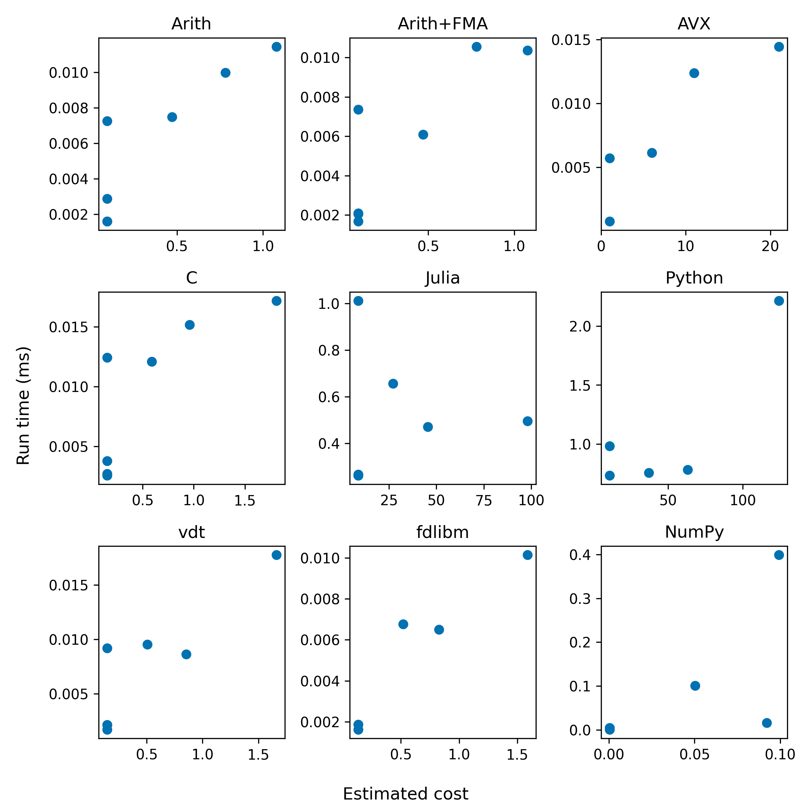

# Target-Aware Implementation of Real Expressions

This is the artifact for our paper "Target-Aware Implementation of Real Expressions".
In our paper, we presented Chassis,
  a target-aware numerical compiler,
  that compiles mathematical expressions to
  a particular target, including hardware ISAs,
  programming languages, and software libraries.
If you wish to evaluate the artifact,
  please start with the "Getting Started" section
  of this file.
The evaluation takes a couple of hours to run.

## Getting Started

We recommend an x86-64 machine with at least 32 GB of RAM,
  running some Linux distribution.
The machine we used for our evaluation
  used an AMD EPYC 7702 CPU, with 512 GB of RAM,
  running Ubuntu 20.04 LTS.
We ran our evaluation using `bash`.

This guide comes in four parts:
 - Installation
 - Testing
 - Kick the Tires
 - Evaluation

## Installation

The evaluation relies on a number of tools and libraries.
We assume your system has the bare essentials
  including `git` and `make`.

 - Racket
 - Rust
 - Python (with numpy, matplotlib, scipy)
 - Julia
 - CMake
 - Clang
 - libvdt

Please read through each subsection to
  install the necessary software.

### Racket

Install [Racket](https://download.racket-lang.org/) from the official download page.
We recommend at least Racket 8.12.
The `snap` versions of Racket are strongly discouraged
  since they are known to be broken.

### Rust

Install Rust using the [rustup](https://rustup.rs/) installer.
By default, `rustup` installs the newest stable version of Rust.
We used Rust 1.77.2, so it is guaranteed to be newer.
Updating Rust occasionally breaks Rust dependencies for Chassis.
If you experience any problems, you can follow `rustup` documentation
  to install a specific version of Rust.

### Python

Python is installed by default on Linux distributions.
We recommend at least Python 3.10.
If you wish to install a specific version of Python,
  we recommend using [pyenv](https://github.com/pyenv/pyenv)
  as an installer.
We recommend creating a virtual environment
  by running the following series of commands.
Create the virtual environment under `.env` with
```
python3 -m venv .env/
```
Activate the virtual environment using
```
source .env/bin/activate
```
and install `numpy`, `matplotlib`, and `scipy` packages
```
pip install numpy matplotlib scipy
```

### Julia

Install Julia using the [juliaup](https://julialang.org/downloads/) installer.
Like `rustup`, `juliaup` installs the newest stable version of Julia.
We recommend at least Julia 1.10.

### CMake

We require CMake to build the libvdt library.
We recommend installing CMake through your default package manager.
For example, on Ubuntu, you would run
```
apt install cmake
```
This may require root access depending on your system.

### Clang

We used Clang 14 as our C/C++ compiler.
We recommend installing Clang through your package manager.
For example, on Ubuntu, you would run
```
apt install clang
```
This may require root access depending on your system.

### libvdt

The vdt library is a vectorized math library developed at CERN.
To install, clone the [repo](https://github.com/dpiparo/vdt):
```
git clone https://github.com/dpiparo/vdt
```
Then, navigate to the `vdt` directory.
If you're on an x86 machine, run
```
cmake -DAVX=1 .
make
make install
```
If you're on an ARM machine, run
```
cmake -DNEON=1 .
make
make install
```
The final step possibly requires root access.

### Chassis

Ensure you have Chassis cloned from git,
  if you have not cloned it already.
```
git clone https://github.com/bksaiki/herbie
git checkout asplos25-aec
```
Chassis requires Racket and Rust to build.
To build Chassis, run
```
make install
```

## Testing installed software

To ensure that your environment is properly set up.
Run the following commands and ensure they do not print any errors.

Check that Racket is installed.
```
racket -v
```
Check that Rust is installed.
```
cargo --version
```
Check that Clang is installed.
```
clang -v
```
Check that Python is installed with the proper libraries.
```
python3
```
In the Python REPL, run
```
import numpy, matplotlib, scipy
exit()
```
Check that Julia is installed.
```
julia -v
```
Check that `libvdt` is installed by running `clang` with a library flag set.
```
clang -lvdt
```
The command should result in an error.
Specifically, it should complain that it could not find a `main` function.
```
/usr/bin/ld: /lib/x86_64-linux-gnu/Scrt1.o: in function `_start':
(.text+0x1b): undefined reference to `main'
```
If libvdt is not installed, `clang` will print a different error instead.
```
/usr/bin/ld: cannot find -lvdt: No such file or directory
```

To test that Herbie works, run
```
racket src/herbie.rkt shell
```
Assuming every command works above,
  your system should be set up to run the evaluation.
If any of the commands above failed unexpectedly,
  return to the corresponding subsection
  in the installation section.

## Kick the tires

**NOTE**:
If your system is running on ARM,
  set the environment variable `NO_AVX` before
  running the subsequent command.
```
export NO_AVX=1
```

To test if the evaluation will run end-to-end,
  you will run the evaluation on a small set
  of benchmarks.
To run this small evaluation, run
```
THREADS=<n> bash infra/platforms-eval.sh reports bench/tutorial.fpcore
```
where `n` is the number of threads you want to run the evaluation with.
We recommend using 4 threads since some phases of
  the evaluation are memory-intensive.
This command should take about 10 to 20 minutes.
If the evaluation runs to completion,
  the `reports` directory should have the following structure:
```
reports
|-- platforms
    |-- baseline
    |-- cache
    |-- drivers
    |-- herbie-2.0
    |-- output
        |-- baseline-pareto.png
        |-- baseline-pareto2.png
        |-- c-pareto.png
        |-- cost-vs-time.png
```
Please check each of the plots look similar to the following plots.
Keep in mind that there is so little data,
  the exact placement of points is not NOTE.

### Figure 7


### Figure 8


### Figure 9


<!-- ### Figure 10



If the figures on your system look similar,
  you are ready to run the larger evaluation. -->

## Running the evaluation

Our paper has 3 quantitative evaluations:
 - **Can Chassis compile to a diverse set of targets? (Section 6.1)**:
  Our evaluation uses 9 targets in total:
    3 targets involving traditional ISAs,
    3 targets involving programming languages,
    and 3 targets involving software libraries.
  We list their characteristics in Figure 6.
 - **Does Chassis produce faster code, for a given accuracy,
  than the traditional compiler Clang? (Section 6.2)**:
  We show that Chassis finds better accuracy/speedup tradeoffs
    than Clang, at various optimization levels,
    both with and without fast-math.
  Figure 7 shows the aggregated results over 547 benchmarks.
 - **Does Chassis produce faster code,
  for a given accuracy,
  than the numerical compiler Herbie? (Section 6.3)**:
  We show that Chassis finds better accuracy/speedup tradeoffs
    than Herbie, the current state-of-the-art
    floating-point accuracy improver, on all 9 targets.
  These results are in Figures 8 and 9.

Most of our experiments take about a day to run in full.
We recommend first running the evaluation on a subset of the benchmarks used in the paper.
This smaller subset takes about 2 to 3 hours in total.
The evaluation section is split into 2 parts.
1. Implementing Targets (Q1)
2. Comparing to Chassis and Herbie (Q2 and Q3)

### 1. Implementing Targets

The goal of this section is to check
  that Chassis implements the 9 targets
  described in the table in Figure 6.


### 2. Comparing to Chassis and Herbie

The goal of this section is to reproduce
  the plots in Figures 7, 8, and 9.
To reiterate,
  the _full_ evaluation will take about a _day_ to run.
We provide instructions on how to run
  on a subset of the benchmarks,
  which takes 2 to 3 hours.

**NOTE**:
If your system is running on ARM,
  set the environment variable `NO_AVX` before
  continuing with the rest of this section!
```
export NO_AVX=1
```

**NOTE**:
This evaluation is measuring real time.
We recommend closing any application before
  starting this section of the evaluation,
  and not using any other application while
  it is running.

**NOTE**:
Most of the targets use auto-tuned cost models.
These values are tuned for the machine
  that we used for our evaluation.
We do not recommend re-tuning these models
  are it is a mostly manual process.
Of course,
  the more your machine differs from the machine
  used for our evaluation, the acceptable variance in plots
  in this section should be much higher.
We provide instructions on
  how to re-tune the cost models 
  under the "Auto-Tuning Cost Models" section.

### Steps

To start the evaluation,
  run either 
```bash
THREADS=<n> bash infra/platforms-eval.sh reports bench/hamming bench/mathematics
```
for the reduced evaluation, or
```bash
THREADS=<n> bash infra/platforms-eval.sh reports bench/*
```
for the full evaluation,
  where `n` is the number of threads you wish to use.
Again,
  we recommend 4 threads since
  some parts of this process are
  memory-intensive.
This will generate all the necessary figures.
We recommend using `tmux` so that the process can be detached.
The reduced evaluation should take 2 to 3 hours
  while the full evaluation should take about a day.

If the evaluation runs to completion,
  the `reports` directory should have the following structure:
```
reports
|-- platforms
    |-- baseline
    |-- cache
    |-- drivers
    |-- herbie-2.0
    |-- output
        |-- baseline-pareto.png
        |-- baseline-pareto2.png
        |-- c-pareto.png
        |-- cost-vs-time.png
```
All plots are rendered under `reports/platforms/output`.
Figure 7 corresponds to `c-pareto.png`,
  Figure 8 corresponds to `baseline-pareto.png`,
  and Figure 9 corresponds to `baseline-pareto2.png`.

To demonstrate this variance,
  we ran the **reduced** evaluation on other machines;
  the figures and specs for each machine are provided below.

### Figure 7

### Figure 8

### Figure 9


#### 

<!-- ## Analyzing the results

If the evaluation runs to completion,
  the `reports` directory should have the following structure
```
reports
|-- platforms
    |-- baseline
    |-- cache
    |-- drivers
    |-- herbie-2.0
    |-- output
        |-- baseline-pareto.png
        |-- baseline-pareto2.png
        |-- c-pareto.png
        |-- cost-vs-time.png
```
All plots are rendered under `reports/platforms/output`.
The evaluation of Chassis contains 3 figures.
Figure 7 corresponds to `hamming-1/c-pareto.pdf` (left)
  and `mathematics-1/c-pareto.pdf` (right).
Figure 8 corresponds to `baseline-pareto2.pdf`.
Figure 9 corresponds to `cost-vs-time.pdf`.

Since this evaluation measures real running time,
  you should expect to see a deviation in results
  from the figures in the paper.
To demonstrate this variance,
  we ran our evaluation on other machines
  and plotted the results;
  the figures and specs for each machine are provided below.
The first row of each table are
  the figures from the submitted version
  of the paper. -->

<!-- ### Figure 7

| OS | CPU | RAM (GB) | NMSE | Mathematics |
|--|--|--|--|--|
| Ubuntu 20.04.6 LTS | AMD EPYC 7702P | 512 |  |  |
| Ubuntu 22.04.2 LTS | Intel i5-8279U | 16 |  |  |

### Figure 8

| OS | CPU | RAM (GB) | Figure 8 |
|--|--|--|--|
| Ubuntu 20.04.6 LTS | AMD EPYC 7702P | 512 |  |
| Ubuntu 22.04.2 LTS | Intel i5-8279U | 16 |  |

### Figure 9

| OS | CPU | RAM (GB) | Figure 9 |
|--|--|--|--|
| Ubuntu 20.04.6 LTS | AMD EPYC 7702P | 512 |  |
| Ubuntu 22.04.2 LTS | Intel i5-8279U | 16 |  | -->

## Auto-Tuning Cost Models
